[toc]

### netty概述

- [netty](netty.io)是一个**异步的基于事件驱动的网络应用框架**，用于快速开发可维护的高性能协议服务端和客户端。

#### 设计

- 针对各种传输类型设计了一个统一的API，无论是阻塞的还0是非阻塞的socket。

- 基于一种灵活的并且可扩展的事件模型，可进行关注点分离

- 提供了高度可定制化的线程模型，单线程、一个或多个线程池等，比如`SEDA`

  > `SEDA：Staged Event Driven Architecture`，把一个请求处理过程分成若干`Stage`，不同的`Stage`使用不同数量的线程来处理

- 可以真正实现无连接的数据报支持

  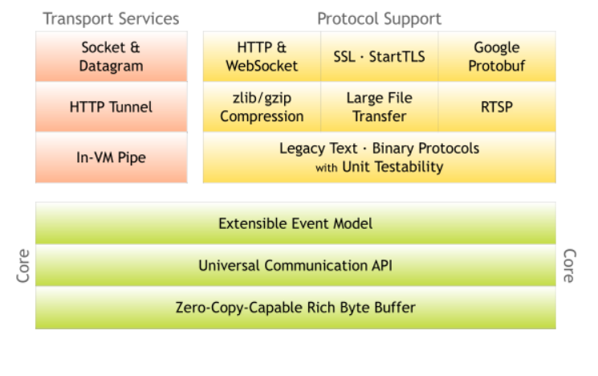

### BIO

- 

#### 装饰者模式

- 装饰者模式是继承关系的一个替代方案，**可以在不创建更多子类，不必改变原类文件的情况下，通过创建一个包装对象，动态扩展对象功能**
- 装饰者模式用来扩展特性对象的功能，不需要子类，是动态扩展，运行时分配职责，可以防止由于子类而导致的复杂和混乱，有更多的灵活性，对于一个给定的对象，同时可能有不同的装饰对象，客户端可以通过它的需要选择合适的装饰对象发消息
- 继承用来扩展一类对象的功能，需要子类，是静态的，编译时分配职责，导致很多子类产生，确认灵活性

### NIO

- `BIO`中最为核心的概念是流(`Stream`)，面向流编程，一个流要么是输入流，要么是输出流
- `NIO`核心：通道、缓冲区、选择器。`NIO`中是面向块(`block`)或是缓冲区(`buffer`)编程的
- `Buffer`本身就是一块内存，实际是个数组，数据的读写都是通过`buffer`来实现
- `Channel`值得是可以向其写入数据或者从中读取数据的对象
- `Channel`是双向的，一个流只可能是输入流或者输出流，但`Channel`打开后可以读、写

### java.nio.Buffer

> 一个具体的原生类型的数据容器
>
> Buffer是一个线性的，特定原生类型元素的有限序列，除了它的内容之外，一个`buffer`重要的属性就是`capacity`，`limit`，`position`
>
> 一个`buffer`的`capacity`就是它所包含的元素数量，一个`buffer`的`capacity`不会为负数并且不会变化
>
> 一个`buffer`的`limit`指第一个不应该被读或写的元素索引，一个`buffer`的`limit`不会为负数并且不会大于`capacity`
>
> 一个`buffer`的`position`指下一个将被读或写的元素索引。一个`buffer`的`position`不会为负数并且不会大于`limit`

- 比如创建一个大小为`10`的`ByteBuffer`对象，初始时`position=0`，`limit`和`capacity`为`10`

  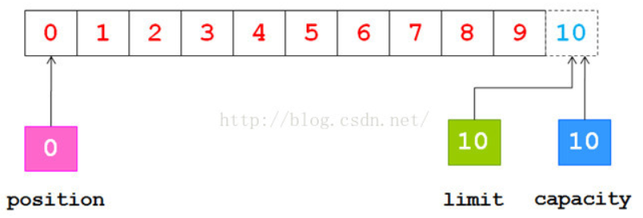

- 调用`buffer.put()`方法或`channel.read()`方法向`buffer`输入4个字节数据后，`position`指向4，即下一个操作的字节索引为4

  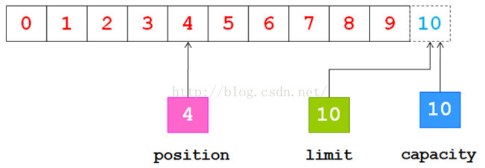

- 如果从`buffer`输出数据，在此之前**必须调用`flip()`方法**，它将`limit`设为`position`当前位置，将`position`设为`0`

  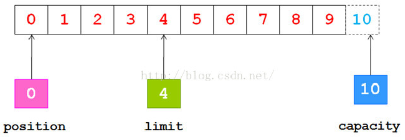

- 调用`buffer.get()`方法或者`channel.write()`把让`buffer`输出数据后，`position`增加，`limit`不变，但`position`不会超过`limit`。把`4`字节数据都输出后，`position`、`limit`都指向4
- 比如创建一个大小为10的`ByteBuffer`对象，初始时`position`=0，`limit`和`capacity`为10

  

- 调用`put()`方法从通道中读4个字节数据到缓冲区后，`position`指向4，即下一个操作的字节索引为4

  

- 再从缓冲区把数据输出到通道，在此之前**必须调用`flip()`方法**，它将`limit`设为`position`当前位置，将`position`设为0

  

- 调用`get()`方法把数据从缓冲区输出到通道，`position`增加，`limit`不变，但`position`不会超过`limit`。把4字节数据都输出后

  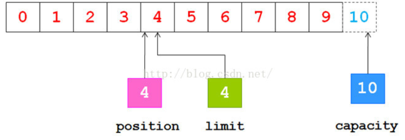

- 调用`clear()`方法，指针又变为原状态

  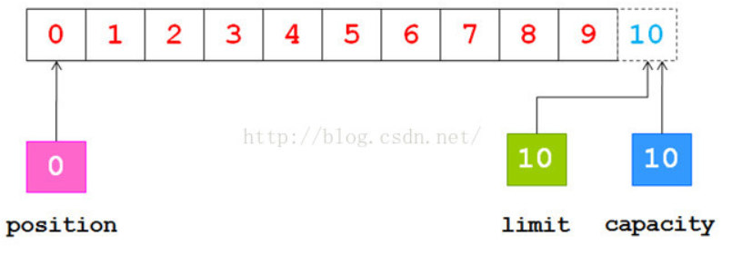

> 对于每个非布尔类型的原生类型，这个类都有一个子类
>
> 每个子类都定义了两类`get`和`put`操作
>
> 相对操作：从当前`position`开始根据传入的元素个数增加`position`位置，读或写一个或多个元素。如果所要求的转换超过了`limit`大小，那么相对的`get`操作会抛出`BufferUnderflowException`异常，相对的`put`操作会抛出`BufferOverflowException`异常，无论哪种情况，都没有数据传输
>
> 绝对操作：接收一个显示的元素索引，不会影响`position`，如果操作的元素索引超出了`limit`大小，那么`get`或`put`操作会抛出`IndexOutOfBoundsException`异常
>
> 数据还可以通过恰当的`IO`通道这种操作来输入或者从`buffer`输出，它总是相对于当前的`position`。
>
> 一个`buffer`的`mark`表示当`reset()`方法被调用时它的`position`会被重置到哪个索引位置。`mark`标记不一定总会被定义，但如果定义了`mark`，`mark`就不能为负数或者大于`position`。如果`mark`定义了，当`position`或者`limit`调节到比`mark`小的值时，`mark`会被丢弃。如果`mark`没有定义，但调用了`reset()`方法，就会抛出`InvalidMarkException`异常。

- **`0 <= mark <= position <= limit <= capacity`**

> 一个新创建的`buffer`，它的`position`值总是为0，`mark`值是未定义的。`limit`值可能是0，也可能是其他值，取决于`buffer`构建的方式，新分配的`buffer`它的每个元素都是0
>
> 除了访问`position`、`limit`、`capacity`值及重置`mark`值之外，这个类还定义了如下操作
>
> `clear()`让一个`buffer`准备好一个新的通道的读或者相对的`put()`操作，它会将`limit`设为`capacity`的值，将`position`设为0。
>
> `flip()`让一个`buffer`准备好一个新的通道的写或者相对的`get()`操作，它会将`limit`设为`position`的值，将`position`设为0。
>
> `rewind()`让一个`buffer`准备好重新读它已经包含的数据，它会将`limit`保持不变，将`position`设置为0。
>
> 每个`buffer`都是可读的，但不是每个`buffer`都是可写的，每个`buffer`的可变方法都被指定为可选操作，如果在只读`buffer`上调用写方法会抛出`ReadOnlyBufferException`异常。只读`buffer`不允许内容发生改变，但它的`mark`、`position`、`limit`值是可以变化的，无论一个`buffer`只读与否，都可以通过`isReadOnly()`方法来判断。
>
> `buffer`不是线程安全的，如果`buffer`在多线程中使用，需要进行合适的同步操作
>
> 这个类中的方法，如果没有指定返回值，那么会返回这个`buffer`本身。这就允许方法可以链接起来，比如：
>
> ```java
> b.flip();
> b.position(23);
> b.limit(42)
> ```
>
> 可以被
>
> ```java
> b.flip().position(23).limit(42)
> ```
>
> 替代

#### 零拷贝

- 创建`ByteBuffer`时，可以用`ByteBuffer.allocate(1024)`创建指定大小的`HeapByteBuffer`对象，`HeapByteBuffer`也即在堆中分配的`ByteBuffer`；

  也可以用`ByteBuffer.allocateDirect(1024)`来创建，它创建的是`DirectByteBuffer`对象

  ```java
      DirectByteBuffer(int cap) {                   
          super(-1, 0, cap, cap);
          boolean pa = VM.isDirectMemoryPageAligned();
          int ps = Bits.pageSize();
          long size = Math.max(1L, (long)cap + (pa ? ps : 0));
          Bits.reserveMemory(size, cap);
  
          long base = 0;
          try {
              //DirectByteBuffer由unsafe对象调用native方法来分配
              base = unsafe.allocateMemory(size);
          } catch (OutOfMemoryError x) {
              Bits.unreserveMemory(size, cap);
              throw x;
          }
          unsafe.setMemory(base, size, (byte) 0);
          if (pa && (base % ps != 0)) {
              // Round up to page boundary
              address = base + ps - (base & (ps - 1));
          } else {
              address = base;
          }
          cleaner = Cleaner.create(this, new Deallocator(base, size, cap));
          att = null;
      }
  ```

  `DirectByteBuffer`由`unsafe`对象调用`native`方法`allocateMemory`在堆外(操作系统中)分配。

  由`Deallocator`释放，`Deallocator`是`DirectByteBuffer`的静态私有内部类，实现了`Runnable`方法，其`run`方法中通过`unsafe.freeMemory(address)`释放。

- 在它们的父类`java.io.Buffer`中，有如下`address`字段，这个`address`只会被`direct buffer`所使用，之所以把它升级放在了`java.io.Buffer`中，是为了提升`JNI GetDirectBufferAddress`的速率。当使用`DirectByteBuffer`时由`address`来操作堆外内存，保证不会内存泄露。

  ```java
      // Used only by direct buffers
      // NOTE: hoisted here for speed in JNI GetDirectBufferAddress
      long address;
  ```

- 在堆中分配的`HeapByteBuffer`，它的字节数组是在java堆上分配的，但进行IO操作时，操作系统并不直接处理堆上的字节数组，而是在操作系统上开辟一块内存区域，将堆上字节数组的数据拷贝到该内存区域，然后该内存区域与IO设备进行交互

- 如果使用`DirectByteBuffer`，就不会在堆上分配数组，而是直接在操作系统中分配。就少了一次数据拷贝的过程。

- 为何操作系统不直接访问`java`堆上的数据，而要拷贝到堆外：操作系统在内核态是可以访问任何一块内存区域的，如果访问堆，会通过`JNI`方式来访问，内存地址确定了，才能根据地址访问。但如果访问时，发生了`GC`，可能碰到标记-压缩，压缩后对象地址就发生了变化，再访问就出问题了。如果不`GC`，有可能会发生`OutOfMemoryError`。如果让对象位置不移动，也不可行。所以不能直接访问`java`堆上的数据

- 进行`IO`操作时，`IO`速度相对较慢，将堆上数据拷贝到操作系统相对较快(`JVM`保证拷贝时不会`GC`)，所以是可行的。

### java.nio.MappedByteBuffer

- 是`java.nio.ByteBuffer`的子类，`java.nio.ByteBuffer`又是`java.nio.Buffer`的子类
- 是一种允许程序直接从内存访问的特殊文件，可以将文件映射到内存中，由操作系统负责将内存修改写入到文件中，我们只需要处理内存的数据。用于内存映射的文件内存本身是在堆外，

> 一个`direct byte buffer`，内容是一个文件的内存映射区域(`memory-mapped region`)
>
> `MappedByteBuffer`可以通过`java.nio.channels.FileChannel.map()`创建，它继承了`ByteBuffer`，它操作都是特定于内存映射的文件区域
>
> 一个`mapped byte buffer`以及它所代表的文件映射在`buffer`本身被垃圾回收前一直有效
>
> `mapped byte buffer`的内容随时可以更改，比如说，如果一个映射文件的区域里对应的内容被另外的程序修改了，不管是否发生了这种改变，或者何时发生，都是依赖于操作系统的，因此是未指定的
>
> 一个`mapped byte buffer`的所有部分也可能是在任何时候都无法访问的，比如映射文件被删除了。尝试访问一个不可访问的`mapped byte buffer`区域不会改变该`buffer`的内容，但会在访问时或访问之后造成一种未指定的异常。因此强烈建议除了读或写文件的内容之外，采取合适的预防措施避免这个程序操控内存映射文件，或者同时运行程序。
>
> 在其他方面，`mapped byte buffer`与普通直接字节内存行为上没什么不同

### java.nio.channels.Channel

> `IO`操作的连接
>
> 一个`channel`代表与一个实体建立连接，比如一个硬件设备，一个文件，一个网络套接字，或者一个有能力执行一个或多个不同的`IO`操作的程序组件，比如读或写
>
> 一个`channel`要么是打开的，要么是关闭的，一个`channel`在创建时打开，一旦关闭就永久关闭了。一旦一个`channel`关闭了，任何在它上面调用`IO`操作的尝试都会导致抛出`ClosedChannelException`，无论一个`channel`是否打开，可通过调用`isOpen()`方法来测试
>
> 通常，`channel`对于多线程的访问时安全的，如扩展和实现该接口的接口和类规范中所述

#### `boolean isOpen()`

> 检测这个`channel`是否是打开的

### java.nio.channels.Selector

> 是一个多路复用的`java.nio.channels.SelectableChannel`对象
>
> `selector`可以通过调用这个类的`open()`方法来创建，`open()`会使用系统默认的`java.nio.channels.spi.SelectorProvider`选择器提供者来创建新的`selector`，`selector`也可以通过一个自定义的`selector`提供者调用`java.nio.channels.spi.SelectorProvider.openSelector()`方法来创建，一个`selector`在调用它的`close()`方法之前会一直处于`open`状态
>
> 一个可选择的`channel`注册到`selector`上是通过`java.nio.channels.SelectionKey`对象来表示的，一个`selector`维护三个`selection key`集合：
>
> - `key set`：它包含的`key`表示当前`selector`上注册的`channel`，这个集合通过`keys()`方法返回
> - `selected-key set`：它表示每个`key`的`channel`在`key`的兴趣集中检测到至少一个操作准备就行，这个集合通过`selectedKeys()`方法返回，它永远是`key set`的一个子集
> - `cancelled-key  set`：它表示`key`已经被取消了，但`channel`还没被取消，这个集合不能直接访问。`cancelled-key set`也永远是`key set`的一个子集。
>
> 在一个新的`selector`创建时，这三个集合都是空的
>
> 一个`key`被添加到`selector`的`key set`中是作为通过`SelectableChannel.register(Selector,int)`方法注册一个`channel`的副作用(就是说注册`channel`就会把`key`添加到`selector`中)，`cancelled key`是在`selection`操作期间从`key set`中移除的`key`。`key set`本身是不能直接被修改的。
>
> 当一个`key`被取消时，它会被添加到它的`selector`的`cancelled-key set`中，无论是通过关闭它的`channel`还是调用`SelectionKey.cancel()`方法。取消一个`key`会导致在下次`selection`操作中它的`channel`会被取消注册，此时这个`key`会从`selector`的所有`key`集合中移除掉。
>
> 通过`selection`操作，`key`会被添加到`selected-key set`中，一个`key`可能通过调用这个`set`的`java.util.Set.remove(java.lang.Object)`方法或者根据这个`set`获得的`iterator`的`java.util.Iterator.remove()`方法直接从`set`中移除。`key`不会以任何其他的方式从`selected-key set`中移除。特别是，它们不会作为`selection`操作的副作用而被删除。
>
> 在每一个`selection`操作中，`key`可能被添加到一个`selector`的`selected-key set`中或者从`selector`的`selected-key set`中移除，也可能从`cancelled-key set`中移除，`selection`操作是通过`select()`、`select(long)`、`selectNow()`等方法来执行的，分为三个步骤：
>
> - 在`cancelled-key set`中的每个`key`都会从每个`set`中被移除掉，它的`channel`会被取消注册，这个步骤使得`cancelled-key set`变为空集合
>
> - 在`selection`操作开始时，底层的操作系统会查询是否更新未被取消注册的`channel`的准备状况，执行任何我们的感兴趣的操作，对于准备有至少一个这样操作的`channel`来说，如下两个动作会执行：
>
>   - 如果`channel`的`key`不在`selected-key set`中，它会被添加到`set`中，它的`ready-operation set`会被修改以精确地表示`channel`已经报告准备好的这些`operation`，任何之前记录的准备信息会被丢弃掉。
>   - 如果`channel`的`key`已在`selected-key set`中，它的`ready-operation set`会被修改以便标识`channel`已经报告准备好的任何新的操作。之前所记录的准备信息会被保留下来，换句话说，由操作系统返回的准备集合会按位的方式放到`key`的当前的准备集合中。
>
>   如果`key set`中所有的`key`在这个步骤开始时没有感兴趣的集合，那么`selected-key  set`或者任何`key`的`ready-operation`都不会被更新s
>
> - 如果在步骤2中有任何`key`被添加到`cancelled-key set`中，那么它们会在步骤1中被处理
>
> 无论一个`selection`操作是否阻塞的等待一个或多个`channel`变得可用，如果是，等待多长时间，这是这三个`selection`方法的本质区别。
>
> 多线程环境下使用，`Selector`本身是安全的，但`key set`不是线程安全的
>
> `selection`操作同步在`selector`上，在`key set`上，也同步在`selected-key set`上，在上面的三个步骤中，也同步在`cancelled-key`上
>
> 当一个`selection`操作在执行时，修改`selector`的`key`的感兴趣的集合对这个操作是没有影响的，这个修改在下个`selection`操作中可见
>
> `key`可能在任何时候被取消，`channel`也可能在任何时候被关闭，因此在`selector`的一个或多个`key set`中存在键并不意味着`key`有效或者`channel`是打开的。应用程序应该注意同步，如果有其他可能的线程取消一个`key`或者关闭`channel`，必要时要检查这种情况
>
> 在`java.nio.channels.Selector#select()`方法或者`java.nio.channels.Selector#select(long)`方法中阻塞的线程，可能以以下三种方式之一被其他线程打断
>
> - 通过调用`selector`的`java.nio.channels.Selector#wakeup`方法
> - 通过调用`selector`的`java.nio.channels.Selector#close`方法
> - 通过调用阻塞线程的`java.lang.Thread#interrupt`方法，这种情况下它会被设置中断标志，`selector`的`wakeup()`方法会被调用
>
> 在一个`selection`操作中，`java.nio.channels.Selector#close`方法会以相同的顺序同步在`selector`和三个`key set`中
>
> 一个`selector`的`key`和`selected-key set`在多线程并发中使用通常不是安全的，如果一个线程直接修改集合中的一个，那么这个访问要通过`set`本身做一个同步。由`set`的`java.util.Set.iterator()`方法所返回的`iterator`是快速失败的，如果在`iterator`创建后`set`被修改了，除了调用`iterator`自己的`java.util.Iterator.remove()`方法之外，任何其他修改都会导致`java.util.ConcurrentModificationException`

#### `Selector open()`

```java
	public static Selector open() throws IOException {
        return SelectorProvider.provider().openSelector();
    }
```

> 打开一个选择器
>
> 新的`selector`是系统范围内的`java.nio.channels.spi.SelectorProvider`对象通过调用`java.nio.channels.spi.SelectorProvider.openSelector()`来创建，

#### `boolean isOpen()`

> 检测`selector`是否是打开的

`SelectorProvider provider()`

> 返回创建这个`channel`的`provider`

#### `Set<SelectionKey> keys()`

> 返回这个`selector`的`key set`
>
> 这个`key set`不能直接修改，一个`key`必须在它已经被取消，它的`channel`已经被取消注册之后才能被移除，任何修改`key set`的尝试会导致抛出`UnsupportedOperationException`
>
> `key set`不是线程安全的

#### `Set<SelectionKey> selectedKeys()`

> 返回这个`selector`的`selected-key set`
>
> `key`可以从`selected-key set`中移除，但不能直接添加到`selected-key set`中，任何添加一个对象到`key set`中的尝试会导致抛出`UnsupportedOperationException`
>
> `selected-keyset`不是线程安全的

#### `int selectNow()`

> 选择`key`的一个集合，它对应的`channel`已经为`IO`操作做好准备了
>
> 这个方法是一个非阻塞的`selection`操作，如果自从前一个`selection`操作之后没有`channel`成为`selectable`，那么这个方法就会返回`0`

#### `int select(long timeout)`

> 选择`key`的一个集合，它对应的`channel`已经为`IO`操作做好准备了
>
> 这个方法是一个阻塞的`selection`操作，当至少一个`channel`是`selected`后才会返回，这个`selector`的`wakeup()`方法会被调用，当前线程中断，或者给定的超时时间到期，以先到者为准。
>
> 这个方法不能提供实时保证：它通过调用`Object`的`wait(long)`方法来调度超时。

#### `int select()`

> 选择`key`的一个集合，它对应的`channel`已经为`IO`操作做好准备了
>
> 这个方法是一个阻塞的`selection`操作，当至少一个`channel`是`selected`后才会返回，这个`selector`的`wakeup()`方法会被调用，或者当前线程被中断，以先到者为准。

#### `Selector wakeup()`

> 让第一个尚未返回的`selection`操作返回
>
> 如果有另外一个线程调用`select()`或者`select(long)`后正在阻塞，那么会让那个调用立即返回，如果此时没有`selection`操作正在执行，那么下次调用这些方法时就会立即返回，除非同时调用了`selectNow()`方法。任何情况下这个调用的返回值可能是非`0`的。后续`select()`或者`select(long)`的调用依旧像平常一样阻塞，除非再次调用了这个方法
>
> 在两次成功的`selection`操作之间多次调用这个方法与只调用一次这个方法的作用相同

### java.nio.channels.SelectionKey

> 一个代表`java.nio.channels.SelectableChannel`注册到`java.nio.channels.Selector`的`token`。
>
> 每次一个`channel`注册到`selector`上`selection key`都会被创建，在调用它的`cancel()`方法或者关闭它的`channel`或者关闭它的`selector`之前，这个`key`都有效。取消一个`key`，不会立马从它的`selector`中移除，而是在下次进行`selection`操作时添加到`cancelled-key set`中进行移除。`key`的有效性可以通过`isValid()`方法检测
>
> 一个`selecton key`包含两个用整数表示的操作集合，每组操作集合表示`key`的`channel`支持的`selectable`操作的分类。
>
> - `interest set`决定哪些操作分类在下次调用`selector`的`selection method`之一的方法时进行准备测试，`interest set`在创建`key`的时候，根据给定的值进行初始化，后续也可以通过`interestOps(int)`方法改变。
> - ``ready set`标识哪些操作分类已经由`key`的`selector`检测到它的`channel`已经准备好了。`key`在创建时，`ready set`被初始化为`0`，后续可通过`selection`操作由`selector`来更新，但不能直接更新
>
> 一个`selection key`的`ready set`表示它的`channel`已经暗示某些操作分类已经准备好了，但不保证当一个线程执行分类中的一个操作时不会造成线程阻塞，`ready set`在`selection`操作完成后是最准确的，也可能由相应的`channel`调用外部事件、`IO`操作等变得不准确
>
> 这个类定义了所有已知的`operation-set`，但给定`channel`所支持的确切位取决于`channel`的类型。每一个`java.nio.channels.SelectableChannel`的子类都会定义一个`validOps()`方法，它会返回一个集合，表示这些操作能被`channel`支持，如果尝试测试一个`operation-set bit`是否被一个`key`的`channel`支持，结果会是运行时异常
>
> 通常有必要将特定应用的数据和一个`selection key`结合起来，比如一个对象表示一个高级协议的状态并处理准备就绪的通知以便实现这个协议，因此`selection key`支持将单个对象附加到`key`上面，一个对象可以通过`java.nio.channels.SelectionKey#attach`方法被附加，后续也可以通过`java.nio.channels.SelectionKey#attachment`方法获取
>
> `selection key`在多线程并发中使用是安全的，`interest set`的读和操作通常与`selector`的某些操作同步，这个同步如何执行是取决于它的实现：在一个简单的实现中，如果`selection`操作正在执行，读或写一个`interest set`的操作会被无限期的阻塞；在一个高性能的实现中，如果发生同样情况，读或写一个`interest set`的操作会被短暂阻塞。在任何情况下，一个`selection`操作都会用`interest-set`的值作为开始时刻的当前值

#### `SelectableChannel channel()`

> 返回创建这个`key`的`channel`，后续如果`key`被取消了，这个方法依旧会返回这个`channel`

#### `Selector selector()`

> 返回创建这个`key`的`selector`，后续如果`key`被取消了，这个方法依旧会返回这个`selector`

#### `boolean isValid()`

> 辨别这个`key`是否有效，`key`在创建之后，直到它被取消，或者`channel`被关闭，，或者`selector`被关闭之前都是有效的

#### `void cancel()`

> 请求取消这个`key`的`channel`与它的`selector`的注册，返回后`key`会失效，并且会加入到`selector`的`cancelled-key set`中，在下一个`selection`操作中，`key`会从`selector`的所有`key set`中移除
>
> 如果`key`已经取消了，再调用这个方法就没有任何作用，`key`一旦取消，就会永远失效
>
> 这个方法可以在任何时候被调用，它同步在`selector`的`cancelled-key set`上，因此如果同时调用同一个`selector`的取消操作或者选择操作，回发生短暂的阻塞

#### `int interestOps()`

> 获得这个`key`的`interest set`
>
> 保证返回的`set`只包含对这个`key`的`channel`有效的`operation bit`
>
> 这个方法可以在任何时候被调用，不论是否阻塞，阻塞多久，取决于它的实现

`SelectionKey interestOps(int ops)`

> 根据给定值设置`key`的`interest set`，这个方法可以在任何时候被调用，不论是否阻塞，阻塞多久，取决于它的实现

### 零拷贝

- 传统方式

  1. 用户向`kernel`发送`read()`系统调用，切换到内核空间，`kernel`通过`DMA(direct memeory access`)方式将数据从硬盘拷贝到`kernel buffer`中
  2. 将`kernel buffer`数据拷贝到`user buffer`中，切换到用户空间
  3. 执行业务逻辑
  4. 用户向`kernel`发送`write()`系统调用，切换到内核空间，将`user buffer`数据拷贝到`kernel buffer`中，将`kernel buffer`数据拷贝到`kernel socket buffer`，该数据写到网络中后，`write()`返回，切换到用户空间

  - 四次切换、四次数据拷贝

     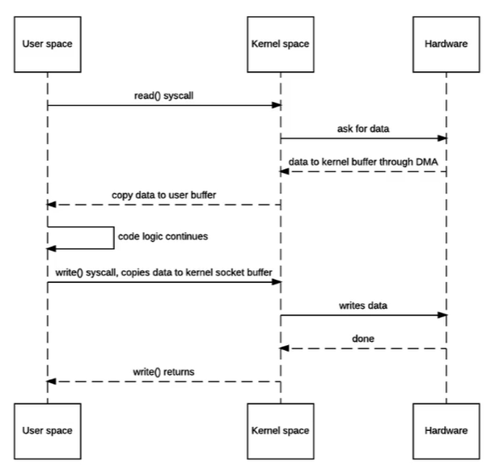

- 改进

  1. 用户向`kernel`发送`sendfile()`系统调用，切换到内核模式，`kernel`通过`DMA(direct memeory access`)方式将数据从硬盘拷贝到`kernel buffer`中
  2. `kernel`将数据写到`target socket buffer`中，从其中发送数据
  3. 发送完后`sendfile()`返回

  - 没有内核空间与用户空间之间的数据拷贝，但内核空间中存在数据拷贝(`kernel buffer --> target socket buffer`)
  - 两次数据拷贝

     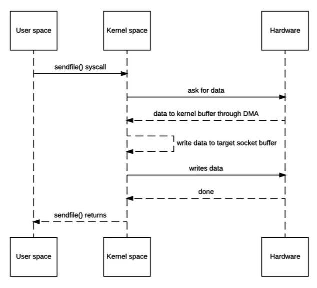

- 改进

  1. 用户向`kernel`发送`sendfile()`系统调用，切换到内核模式，`kernel`通过`DMA(direct memeory access`)方式将数据从硬盘拷贝到`kernel buffer`中，还可以通过`scatter/gather DMA`方式将数据读取到`kernel buffer`中

     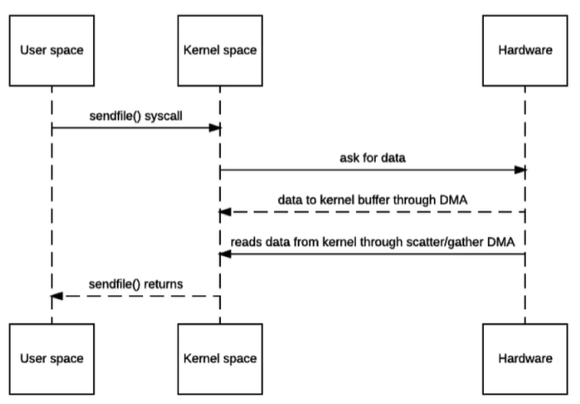

- 零拷贝

  1. 发送`sendfile`系统调用前处于用户空间；发送`sendfile`系统调用后处于内核空间；执行完后又回到用户空间

  2. **将磁盘数据拷贝到`kernel buffer`中，再将`kernel buffer`中数据的`fd(文件描述符)`拷贝到`socket buffer`中，`fd`包含：数据的内存地址、数据的长度。不再需要将数据拷贝到`socket buffer`中了。**

  3. **`protocol engine(协议引擎)`完成数据发送时，从两个`buffer`中读取信息。即`gather(收集)`操作**

     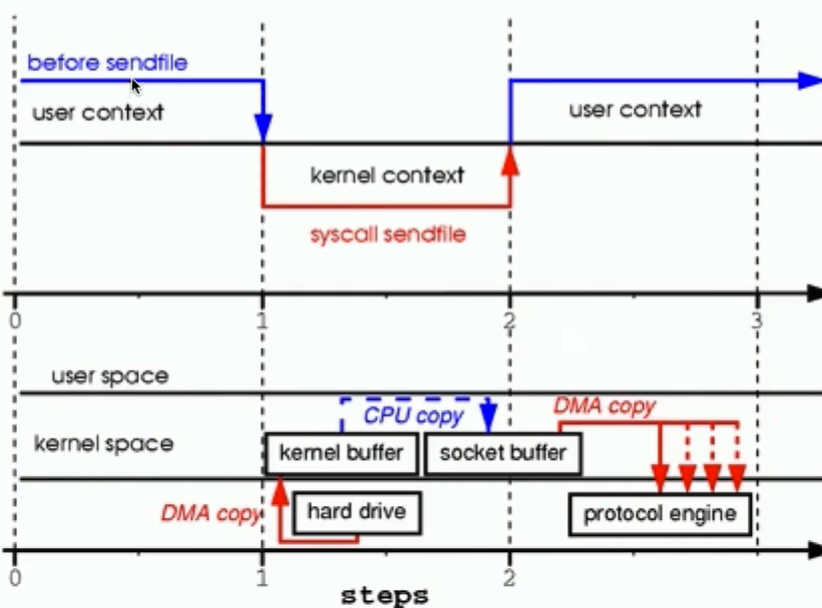

### 源码分析

```java
    /**
     * 启动流程
     */
	public static void main(String[] args) throws InterruptedException {
        EventLoopGroup bossGroup = new NioEventLoopGroup();
        EventLoopGroup workerGroup = new NioEventLoopGroup();
        try {
            ServerBootstrap serverBootstrap = new ServerBootstrap(); 
	    serverBootstrap.group(bossGroup,workerGroup)
                    .channel(NioServerSocketChannel.class)
                    .handler(new LoggingHandler(LogLevel.INFO))
                    .childHandler(new MyServerInitializer());
            ChannelFuture channelFuture = serverBootstrap.bind(8899).sync();
            channelFuture.channel().closeFuture().sync();
        } finally {
            bossGroup.shutdownGracefully();
            workerGroup.shutdownGracefully();
        }
    }
```

#### `io.netty.util.concurrent.EventExecutorGroup`

> `EventExecutorGroup`通过它的`next()`方法提供`io.netty.util.concurrent.EventExecutor`进行使用，除此之外，还负责它们的生命周期以及对它们以全局的方式进行关闭

##### `EventExecutor next()`

> 返回由`EventExecutorGroup`所管理的`io.netty.util.concurrent.EventExecutor`

#### `io.netty.channel.EventLoopGroup`

- 继承自`EventExecutorGroup`接口

> 是一个特殊的`io.netty.util.concurrent.EventExecutorGroup`，在进行事件循环的过程中，在选择操作时允许注册`channel`

##### `EventLoop next()`

> 返回下一个要使用的`io.netty.channel.EventLoop`

##### `ChannelFuture register(Channel channel)`

> 将一个`channel`注册到`io.netty.channel.EventLoop`中，当注册完成时返回的`io.netty.channel.ChannelFuture`对象会收到通知。

##### `ChannelFuture register(ChannelPromise promise)`

> 使用一个`io.netty.channel.ChannelFuture`将一个`channel`注册到`io.netty.channel.EventLoop`中，当注册完成时传入的`io.netty.channel.ChannelFuture`会收到通知并进行返回。

#### `io.netty.channel.nio.NioEventLoopGroup`

- 继承`MultithreadEventLoopGroup`类，`MultithreadEventLoopGroup`类实现了`EventLoopGroup`接口

> 是`io.netty.channel.MultithreadEventLoopGroup`的一个实现，它用于基于`io.netty.channel.Channel`的NIO`java.nio.channels.Selector`对象

```java
	/**
	 * 使用默认的线程数、默认的java.util.concurrent.ThreadFactory，以及
	 * java.nio.channels.spi.SelectorProvider的provider()方法返回的SelectorProvider创建新的实
	 * 例
	 */
	public NioEventLoopGroup() {
        	this(0);
    	}

	/**
	 * 使用指定的线程数、java.util.concurrent.ThreadFactory以及java.nio.channels.spi.
	 * SelectorProvider的provider()方法返回的SelectorProvider创建新的实例
	 *
	 */
	public NioEventLoopGroup(int nThreads) {
        	this(nThreads, (Executor) null);
    	}

	// ...
    
	// 构造方法中nThreads的取值：nThreads == 0 ? DEFAULT_EVENT_LOOP_THREADS : nThreads
	// 其父类MultithreadEventLoopGroup中设置DEFAULT_EVENT_LOOP_THREADS如下：
	private static final int DEFAULT_EVENT_LOOP_THREADS;
    	static {
        	// 如果没有配置io.netty.eventLoopThreads，就取 系统核数 * 2，否则取配置的数量，最小取1
        	DEFAULT_EVENT_LOOP_THREADS = Math.max(1, SystemPropertyUtil.getInt(
                	"io.netty.eventLoopThreads", NettyRuntime.availableProcessors() * 2)
		);
   	 }
	// 最终会执行MultithreadEventExecutorGroup抽象类中的构造方法，
	// NioEventLoopGroup继承自MultithreadEventLoopGroup抽象类，
	// MultithreadEventLoopGroup继承自MultithreadEventExecutorGroup抽象类，
	// 该方法中根据nThreads生成EventExecutor children = new EventExecutor[nThreads]数组
	// 对于数组每个元素，通过children[i] = newChild(executor, args)进行赋值
	/** 
	 * MultithreadEventExecutorGroup中的newChild方法
	 * 创建一个新的EventExecutor，后续可通过next()方法进行访问它，这个方法将被服务与
	 * MultithreadEventExecutorGroup的每个线程所调用
	 */
	abstract EventExecutor newChild(Executor executor, Object... args) throws Exception
```

#### `io.netty.bootstrap.ServerBootstrap`

> `io.netty.bootstrap.Bootstrap`的一个子类，使得我们可以轻松的启动`io.netty.channel.ServerChannel`
>
> `ServerChannel`：一个标记接口（和`java.io.Serializable`一样），会接收另外一端发过来的连接请求，并通过接收它们来创建`child`   `io.netty.channel.Channel`，例如`io.netty.channel.socket.ServerSocketChannel`。

##### `group(EventLoopGroup parentGroup, EventLoopGroup childGroup)`

- `ServerBootstrap`类中的`group`方法

> 给`parent(acceptor)`和`child(client)`设置`EventLoopGroup`，这些`EventLoopGroup`用于处理`ServerChannel`和`Channel`的所有事件和IO
>
> ```java
> /** 这个方法的作用就是赋值bossGroup,workerGroup，也可以说parentGroup和childGroup */
> public ServerBootstrap group(EventLoopGroup parentGroup, EventLoopGroup childGroup) {
>     super.group(parentGroup);
>     if (childGroup == null) {
>         throw new NullPointerException("childGroup");
>     }
>     if (this.childGroup != null) {
>         throw new IllegalStateException("childGroup set already");
>     }
>     this.childGroup = childGroup;
>     return this;
> }
> ```

##### `channel(Class<? extends C> channelClass)`

其父类`AbstractBootstrap`类中的`channel`方法

> 根据Class对象，创建对应的`io.netty.channel.Channel`实例。如果你的`Channel`没有无参的构造方法，要么使用这个，要么使用`channelFactory(io.netty.channel.ChannelFactory)`
>
> ```java
> public B channel(Class<? extends C> channelClass) {
>     // ...
>     return channelFactory(new ReflectiveChannelFactory<C>(channelClass));
> }
> /** 
>  * ReflectiveChannelFactory实现了ChannelFactory，它会以反射的方式通过调用默认构造方法实例化一
>  * 个新的Channel对象C
>  * 这里new ReflectiveChannelFactory()后，传给channelFactory做参数，类型为ChannelFactory
>  */
> 
> /**
>  * io.netty.channel.ChannelFactory用于在调用bind()方法时创建Channel实例。这个方法通常在由于
>  * 复杂的需求导致channel()方法无法使用时才使用，如果你的Channel实现有一个无参构造器，那么非常推荐
>  * 直接使用channel()方法来简化你的代码
>  */
> public B channelFactory(io.netty.channel.ChannelFactory<? extends C> channelFactory) {
>     return channelFactory((ChannelFactory<C>) channelFactory);
> }
> 
> /** 这个channelFactory方法就是为了给channelFactory属性赋值 */
> public B channelFactory(ChannelFactory<? extends C> channelFactory) {
>     // ...
>     this.channelFactory = channelFactory;
>     return (B) this;
> }
> ```

##### `io.netty.channel.socket.nio.NioServerSocketChannel`

> 是`io.netty.channel.socket.ServerSocketChannel`的一个实现，它使用了`NIO`的`selector`的实现来接收新的连接

##### `childHandler(ChannelHandler childHandler)`

- `ServerBootstrap`类中的`childHandler`方法

> 赋值`childHandler`，用于服务`Channel`的请求
>
> ```java
> public ServerBootstrap childHandler(ChannelHandler childHandler) {
>     // ...
>     this.childHandler = childHandler;
>     return this;
> }
> ```

##### `ChannelFuture bind(int inetPort)`

- 其父类`AbstractBootstrap`类中的`bind`方法

> ```java
> // 创建一个新的Channel并绑定它
> public ChannelFuture bind(int inetPort) {
>     return bind(new InetSocketAddress(inetPort));
> }
> 
> // 创建一个新的Channel并绑定它
> public ChannelFuture bind(SocketAddress localAddress) {
>     // ...
>     return doBind(localAddress);
> }
> 
> private ChannelFuture doBind(final SocketAddress localAddress) {
>     // 初始化并绑定channel，返回其异步执行的结果：ChannelFuture
>     final ChannelFuture regFuture = initAndRegister();
>     final Channel channel = regFuture.channel();
>     // cause()：返回IO操作失败的原因
>     if (regFuture.cause() != null) {
>         return regFuture;
>     }
>     // isDone()：返回任务是否已完成，任务可能正常结束、可能发生异常、也可能被取消
>     if (regFuture.isDone()) {
>         // 进入判断就肯定任务已经完成了
>         // 返回一个新的io.netty.channel.ChannelPromise，ChannelPromise是一种
>         // 可写的特殊的ChannelFuture
>         ChannelPromise promise = channel.newPromise();
>         // 调用doBind0()进行绑定，如果initAndRegister()执行成功(通过regFuture判断)，就
>         // 给channel绑定localAddress，并添加监听器ChannelFutureListener.CLOSE_ON_FAILURE
>         // 如果失败，就将原因写入到ChannelPromise中(ChannelPromise就是可写的ChannelFuture)
>         doBind0(regFuture, channel, localAddress, promise);
>         return promise;
>     } else {
>         // 注册的future几乎已经完成了,但以防万一
>         final PendingRegistrationPromise promise = new PendingRegistrationPromise(channel);
>         regFuture.addListener(new ChannelFutureListener() {
>             @Override
>             public void operationComplete(ChannelFuture future) throws Exception {
>                 Throwable cause = future.cause();
>                 if (cause != null) {
>                     // 在EventLoop中注册失败，因此在访问Channel的EventLoop时，
>                     // ChannelPromise不能直接导致IllegalStateException
>                     promise.setFailure(cause);
>                 } else {
>                     // 注册操作已完成, 所以设置正确的执行器去使用
>                     // See https://github.com/netty/netty/issues/2586
>                     promise.registered();
>                     doBind0(regFuture, channel, localAddress, promise);
>                 }
>             }
>         });
>         return promise;
>     }
> }
> 
> 
> final ChannelFuture initAndRegister() {
>     Channel channel = null;
>     try {
>         // 这里的channelFactory是io.netty.channel.ReflectiveChannelFactory类型
>         // 通过反射创建io.netty.channel.socket.nio.NioServerSocketChannel实例
>         channel = channelFactory.newChannel();
>         // 调用ServerBootStrap中的init()方法初始化channel：
>         // 	1. 给channel设置options，options为LinkedHashMap类型
>         //	2. 给channel设置attrs，attrs也是LinkedHashMap类型
>         //	3. 判断channel的pipeline中是否添加了handler，如果添加了就把handler添加到
>         //		管道的最后
>         // 	4. 往管道中添加一个ServerBootstrapAcceptor
>         init(channel);
>     } catch (Throwable t) {
>         if (channel != null) {
>             channel.unsafe().closeForcibly();
>         }
>         return new DefaultChannelPromise(channel, GlobalEventExecutor.INSTANCE).setFailure(t);
>     }
>     // config()：ServerBootstrapConfig
>     // group()：NioEventLoopGroup
>     // register()：将channel注册到NioEventLoopGroup中，注册完成时ChannelFuture收到通知
>     ChannelFuture regFuture = config().group().register(channel);
>     // cause()：返回IO操作失败的原因
>     if (regFuture.cause() != null) {
>         if (channel.isRegistered()) {
>             channel.close();
>         } else {
>             channel.unsafe().closeForcibly();
>         }
>     }
>     // 如果到这里，就说明操作成功了，就是以下情况之一：
>     // 1) 如果我们尝试从事件循环中注册，那么此时注册已经完成了，也就是说，现在调用bind()方法和
>     //		connect()方法时安全的，因为channel已经被注册了
>     // 2) 如果我们尝试从其他的线程中注册, 那么注册的请求已经成功添加到事件循环后续执行的任务队列中
>     //		也就是说调用bind()方法和connect()方法是安全的，因为bind()方法和connect()方法会在
>     //		已经计划的注册操作之后被执行，因为register()、bind()、connect()方法一定会在同一个
>     //		线程中
>     return regFuture;
> }
> ```

#### `io.netty.channel.ChannelFuture`

- `io.netty.channel.ChannelFuture`接口继承了`io.netty.util.concurrent.Future`，它又继承了`java.util.concurrent.Future`接口

> 表示一个异步`io.netty.channel.Channel` `IO`操作的执行结果
>
> `netty`中所有的`IO`操作都是异步的，这说明所有的`IO`调用会立即返回，但返回后并不保证所请求的`IO`操作已经完成了，相反，你会得到一个`ChannelFuture`的实例，它会给你一些`IO`操作的结果和状态信息
>
> 一个`ChannelFuture`要么是`uncompleted`，要么是`completed`，当`IO`操作开始时，会创建一个新的`future`，这个新的`future`对象初始时是`uncompleted`的，既不是成功的，也不是失败的，也不是取消的，因为`IO`操作是尚未完成的，如果`IO`操作完成了，要么是成功了，要么失败了，或者取消了，那么`future`就会标识为`completed`，并且携带一些信息，比如失败的原因。请注意，失败和取消都属于完成(`completed`)的状态
>
> ```java
>                                      +---------------------------+
>                                      | Completed successfully    |
>                                      +---------------------------+
>                                 +---->      isDone() = true      |
> +--------------------------+    |    |   isSuccess() = true      |
> |        Uncompleted       |    |    +===========================+
> +--------------------------+    |    | Completed with failure    |
> |      isDone() = false    |    |    +---------------------------+
> |   isSuccess() = false    |----+---->      isDone() = true      |
> | isCancelled() = false    |    |    |       cause() = non-null  |
> |       cause() = null     |    |    +===========================+
> +--------------------------+    |    | Completed by cancellation |
>                                 |    +---------------------------+
>                                 +---->      isDone() = true      |
>                                      | isCancelled() = true      |
>                                      +---------------------------+
> ```
>
> `ChannelFuture`提供了非常多的方法让你去检查`IO`操作是否完成了，还是在等待完成，然后获取`IO`操作的结果。也允许你添加`io.netty.channel.ChannelFutureListener`，这样在`IO`操作完成时就可以收到通知
>
> 建议使用`addListener(GenericFutureListener)`方法，而不使用`await()`方法
>
> 任何可能情况下，当`IO`操作完成时建议使用`addListener(GenericFutureListener)`而不是用`await()`获取通知，然后去做任何后续的任务。
>
> `addListener(GenericFutureListener)`是一个非阻塞的方法，它只是将指定的`io.netty.channel.ChannelFutureListener`添加到`ChannelFuture`中，当与`IO`操作关联的`future`完成时，`IO`线程就会通知`listener`，`ChannelFutureListener`会产生最好的性能和资源利用率，因为它一点都不会阻塞，但如果你对事件驱动编程不了解就可能在实现顺序逻辑时比较棘手
>
> 与之相反，`await()`是一个阻塞操作，一旦调用，调用者线程就会阻塞直到操作完成，`await()`实现一个顺序逻辑比较容易，但调用者线程会没必要的阻塞直到`IO`操作完成，`inter-thread`的通知成本也更高，此外，在特定情况也可能出现死锁的情况，就像下面所描述的
>
> 不要在`io.netty.channel.ChannelHandler`内部调用`await()`
>
> `ChannelHandler`中的事件处理的方法通常由`IO`线程调用，如果事件处理的方法调用了`await()`方法，而事件处理的方法由`IO`线程调用，那么`IO`操作可能永远不会完成，因为`await()`方法会阻塞`IO`操作，这种情况就造成死锁
>
> ```java
> // 不好的例子
> public void channelRead(ChannelHandlerContext ctx, Object msg){
>     ChannelFuture future = ctx.channel().close();
>     future.awaitUninterruptibly();
>     // Perform post-closure operation
>     // ...
> }
> 
> // 好的例子
> public void channelRead(ChannelHandlerContext ctx, Object msg) {
>     ChannelFuture future = ctx.channel().close();
>     future.addListener(new  ChannelFutureListener() {
>         public void operationComplete(ChannelFuture future) {
>             // Perform post-closure operation
>             // ...
>         }
>     });
> }
> ```
>
> 尽管上面提到有这些缺陷，某些情况下调用`await()`方法更加方便，在这种情况下，请确保不会在`IO`线程中调用`await()`方法，否则，会抛出`BlockingOperationException`异常来防止死锁
>
> 不要将`IO`超时和等待超时混为一谈
>
> `await(long)`、`await(long, TimeUnit)`、`awaitUninterruptibly(long)`、`awaitUninterruptibly(long, TimeUnit)`方法所指定的超时的值与`IO`超时没有任何关系。如果一个`IO`操作超时，那么`future`会被标记为失败，比如说，连接超时应该通过`transport-specific`选项来配置：
>
> ```java
> // 不好的例子
> Bootstrap b = ...;
> ChannelFuture f = b.connect(...);
> f.awaitUninterruptibly(10, TimeUnit.SECONDS);
> if (f.isCancelled()) {
>     // ...
> } else if (!f.isSuccess()) {
>     // 连接失败，
>     // 原因可能是future还没有完成所以发生了NullPointerException
>     // 也可能是连接超时，这里一块处理了
>     f.cause().printStackTrace();
> } else {
>     // 连接成功...
> }
> 
> // 好的例子
> Bootstrap b = ...;
> // 配置连接超时
> b.option(ChannelOption.CONNECT_TIMEOUT_MILLIS, 10000);
> ChannelFuture f = b.connect(...);
> f.awaitUninterruptibly();
> // 现在可以确保future已经完成了
> assert f.isDone();
> if (f.isCancelled()) {
>     // ...
> } else if (!f.isSuccess()) {
>     // 处理连接失败的原因，与上面的连接超时分开处理
>     f.cause().printStackTrace();
> } else {
>     // 连接成功...
> }
> ```

##### `Channel channel()`

> 返回一个`Channel`，这个`Channel`是与`future`相关的`IO`操作的`Channel`

##### `io.netty.channel.Channel`

> 它表示一个网络`socket`的连接或者是一个可以进行`IO`操作的组件，比如读、写、连接、绑定。
>
> 一个`channel`可以向用户提供如下功能：
>
> - 当前`channel`的状态（比如是否打开了、是否已经连接了）
> - `channel`的配置参数（比如接受的缓冲区大小）
> - `channel`支持的`IO`操作（比如读、写、连接、绑定）
> - 处理与`channel`关联的请求和所有`IO`事件的`ChannelPipeline`
>
> 所有的`IO`操作都是异步的，这意味着所有的`IO`调用都会立即返回，但不保证所请求的`IO`操作在调用结束时已经完成，相反的，你可以得到一个`ChannleFuture`实例，当请求的`IO`操作成功了、失败了、取消了，这个`ChannelFuture`就会通知你。
>
> `Channel`是可继承的，`Channel`根据创建的方式不同可以有一个`parent`，比如一个·`SocketChannel`是被一个`ServerSocketChannel`所接受的，它会将`ServerSocketChannel`作为`parent()`方法返回的结果
>
> 这种层次化结构的语义是取决于`Channel`所属的传输层的实现，比如你可以编写一个新的`Channel`实现让它创建子`Channel`，让这个`Channel`与子`Channel`共享`socket`连接，比如[`GEEP`](http://beepcore.org/)和[`SSH`](http://en.wikipedia.org/wiki/Secure_Shell)。
>
> 向下转换以去访问特定于传输的操作。有些传输会公开额外的操作，这种额外的操作是特定于传输的，这时就可以进行向下转换，将`Channel`转换为它的子类型来去调用这种操作，比如老式的数据报的传输，多个`join/leave`操作是通过`DatagramChannel`来提供的。
>
> 释放资源，当你已经使用完`Channel`后，调用`close()`或者`close(ChannelPromise promise)`去释放所有的资源是很重要的，这种方法可以保证所有的资源以一种恰当的方式得到释放，比如释放文件句柄

##### `java.util.concurrent.Future`

> 一个`Future`代表一个异步计算的结果。`Future`提供了一些方法来检查计算是否完成了，还有些方法会等待计算的完成，还有些方法用来获取计算的结果。当计算完成时，计算的结果只能通过`get()`方法获取，计算完成之前`get()`方法会阻塞。取消操作是通过`cancle()`方法来完成的。此外`Future`还提供了附加的方法来确定任务是正常完成还是取消掉了。一旦计算完成，就不能被取消了。如果你想以取消为目的用了`Future`，但又没有提供一个可用的结果，你就可以声明这种形式的的`Future`，返回`null`作为它底层任务的结果。
>
> ```java
> interface ArchiveSearcher { String search(String target); }
> class App {
>     ExecutorService executor = ...
>     ArchiveSearcher searcher = ...
>     void showSearch(final String target)throws InterruptedException {
>         // 将target交给executor来执行，
>         Future<String> future = executor.submit(new Callable<String>() {
>             public String call() {
>                 return searcher.search(target);
>             }});
>         // 主线程继续往下执行
>         displayOtherThings(); 
>         try {
>             // 这里获取执行的结果
>             displayText(future.get()); 
>         } catch (ExecutionException ex) { 
>             cleanup(); return; 
>         }
>     }
> }
> ```
>
> `java.util.concurrent.FutureTask`是`Future`的实现，它本身实现了`java.util.concurrent.RunnableFuture`，`RunnableFuture`实现了`java.lang.Runnable`、`java.util.concurrent.Future`接口，所以可以被`Executor`执行
>
> 比如说，上面`submit()`方法的构造器可以用以下来替代
>
> ```java
> FutureTask<String> future = new FutureTask<String>(new Callable<String>() {
>     public String call() {
>         return searcher.search(target);
>     }
> });
> executor.execute(future);
> ```
>
> 内存一致性的影响：异步计算的动作一定在另一个线程通过`Future.get()`获取计算结果之前执行的。

###### `get()`

> 如果必要，会等待计算的完成，并获取结果

###### `get(long timeout, TimeUnit unit)`

> 如果可用的话，在必要时最多会等待给定的时间来等待计算的完成，然后获取结果

###### `boolean cancel(boolean mayInterruptIfRunning)`

> 尝试取消任务的执行，如果任务已经完成，或者已经取消，或由于其他原因不能被取消，这个尝试就会失败。如果取消成功，当`cancel()`方法调用时任务还没有开始，任务就不应该再运行了。如果任务已经启动了，`mayInterruptIfRunning`参数决定执行任务的这个线程是否可以被中断去停止这个任务。
>
> 这个方法调用之后，后续的`isDone()`方法将返回`true`，如果这个方法返回`true`，后续的`isCancelled()`就会返回`true`。

###### `boolean isDone()`

> 如果任务已经完成了返回`true`，对于正常结束、异常、取消操作这行情况都会返回`true`

##### `io.netty.util.concurrent.Future`

> 一个异步操作的结果

###### `boolean isSuccess()`

> 当且仅当`IO`操作完成了就返回`true`

###### `boolean isCancellable()`

> 当且仅当操作可以通过`cancel(boolean)`方法取消时返回`true`

###### `Throwable cause()`

> 如果`IO`操作失败了，就会返回失败的原因

###### `Future<V> addListener(GenericFutureListener<? extends Future<? super V>> listener)`

> 给`Future`添加指定的`listener`，当`Future`的`isDone()`方法完成时，`listener`就会收到通知，如果`future`已经了，指定的`listener`就会立刻被通知到

###### `Future<V> sync() throws InterruptedException`

> 等待`future`直到它完成，如果`future`失败会重新抛出失败的原因

###### `Future<V> await() throws InterruptedException`

> 等待`future`的完成

###### `V getNow()`

> 不阻塞的返回结果，如果`future`尚未完成，这个方法就返回`null`。
>
> 由于`null`值可能作为结果标识`future`的成功，所以还需要通过`isDone()`判断`future`是否真的完成了，不要依赖于`null`值

####`io.netty.channel.ChannelPipeline`

> `ChannelPipeline`继承了`ChannelInboundInvoker`、`ChannelOutboundInvoker`、`java.lang.Iterable`三个接口
>
> 它是一个`ChannelHander`的列表（`ChannelHander`即`Reactor`模式中的`Event Handler`），它会处理或者拦截`Channel`中的`inbound`事件和`outbound`操作。`ChannelPipeline`实现了一种高级的[Intercepting Filter](http://www.oracle.com/technetwork/java/interceptingfilter-142169.html)模式，以此让用户完全控制如何处理器事件以及`pipeline`中的`ChannelHandler`是如何交互的
>
> 每个`Channel`都会有一个它自己的`pipeline`，当一个`channel`被创建时，它的`pipeline`会被自动创建
>
> 下面这个图描述了`IO`事件是如何被`ChannelPipeline`中的`ChannelHandler`处理的，一个`IO`事件要么被`ChannelInboundHandler`处理，要么被`ChannelOutboundHandler`处理，再通过调用`ChannelHandlerContext`中定义的事件传播方法转发给最近的`handler`，比如`ChannelHandlerContext#fireChannelRead(Object)`方法、`ChannelHandlerContext#write(Object)`方法。
>
> 如下，`Inbound`与`Outbound`不会产生直接的关联关系，工作是互相隔开的：
>
> ```java
>                               I/O Request via  Channel or ChannelHandlerContext
>                                                      |
>                                   					 |
>  +---------------------------------------------------+---------------+
>  |                           ChannelPipeline         |               |
>  |                                                  \|/              |
>  |    +---------------------+            +-----------+----------+    |
>  |    | Inbound Handler  N  |            | Outbound Handler  1  |    |
>  |    +----------+----------+            +-----------+----------+    |
>  |              /|\                                  |               |
>  |               |                                  \|/              |
>  |    +----------+----------+            +-----------+----------+    |
>  |    | Inbound Handler N-1 |            | Outbound Handler  2  |    |
>  |    +----------+----------+            +-----------+----------+    |
>  |              /|\                                  .               |
>  |               .                                   .               |
>  | ChannelHandlerContext.fireIN_EVT() ChannelHandlerContext.OUT_EVT()|
>  |        [ method call]                       [method call]         |
>  |               .                                   .               |
>  |               .                                  \|/              |
>  |    +----------+----------+            +-----------+----------+    |
>  |    | Inbound Handler  2  |            | Outbound Handler M-1 |    |
>  |    +----------+----------+            +-----------+----------+    |
>  |              /|\                                  |               |
>  |               |                                  \|/              |
>  |    +----------+----------+            +-----------+----------+    |
>  |    | Inbound Handler  1  |            | Outbound Handler  M  |    |
>  |    +----------+----------+            +-----------+----------+    |
>  |              /|\                                  |               |
>  +---------------+-----------------------------------+---------------+
>                  |                                  \|/
>  +---------------+-----------------------------------+---------------+
>  |               |                                   |               |
>  |       [ Socket.read() ]                    [ Socket.write() ]     |
>  |                                                                   |
>  |  Netty Internal I/O Threads (Transport Implementation)            |
>  +-------------------------------------------------------------------+                      
> ```
>
> 一个`inbound`事件是由`inbound handler`自下向上的方向进行处理，`inbound handler`通常处理由`IO`线程所生成的`inbound data`，`inbound data`通常是通过实际的输入操作比如`SocketChannel#read(ByteBuffer)`从远端读取的，如果一个`inbound event`已经超过了`inbound handler`的顶部边界（假设总共只有`N`个`inbound handler`，就不能超过`N`），它就会被悄无声息的丢掉，如果你需要也可以以日志的方式记录下来
>
> `outbound`事件是由`outbound handler`自上至下的方向处理的，`outbound handler`通常会生成或传输`outbound data`比如写请求，如果一个`outbound event`超出了最下面的`outbound handler`，它就会被与`Channel`相关的`IO`线程处理，`IO`线程通常会执行实际的`IO`操作如`SocketChannel#write(ByteBuffer)`
>
> 比如说，假设我们创建了如下的`pipeline`:
>
> ```java
> ChannelPipeline p = ...;
> p.addLast("1", new InboundHandlerA());
> p.addLast("2", new InboundHandlerB());
> p.addLast("3", new OutboundHandlerA());
> p.addLast("4", new OutboundHandlerB());
> p.addLast("5", new InboundOutboundHandlerX());
> ```
>
> 在这里例子中，`Inbound`开头的这个类表示它是一个`Inbound handler`，`Outbound`开头的这个类表示它是一个`Outbound handler`，对于这个配置的例子的来说，当事件`inbound`时的处理顺序就是`1,2,3,4,5`，当事件`outbound`时的处理顺序就是`5,4,3,2,1`，`ChannelPipeline`会跳过某些处理器来减少栈的深度：
>
> 

### Reactor模式

[nio](Reactor/nio-zh_CN.md)

[reactor-siemens](Reactor/reactor-siemens-zh_CN.md)

​		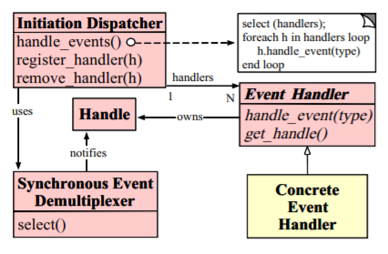

- 概述
  - `Initiation Dispatcher`启动后会将若干个`Event Handler`注册到其上，注册的同时指定感兴趣的事件，这个感兴趣的事件是被`Handle`所标识的，因为`Handle`是被`Event Handler`所拥有的。当感兴趣的事件在`Event Handler`所关联的`Handle`上产生的时候，由`Initiation Dispatcher`通知`Concrete Event Handler`。
  - `Event Handler`注册到`Initiation Dispatcher`完毕之后，`Initiation Dispatcher`就开启了自己的事件循环，是个死循环。由`Synchronous Event Demultiplexer`等待事件的产生，然后它会将产生的事件的集合返回给`Initiation Dispatcher`，`Initiation Dispatcher`选择与事件对应的`Event Handler`，遍历这个`Event Handler`，根据事件的`type`调用注册到其上的`Concrete Event Handler`的`handle event(type)`方法。
- 流程
  1. 当应用向`Initiation Dispatcher`注册具体的事件处理器时，应用会标识出该事件处理器希望`Initiation Dispatcher`在某个事件发生时向其通知的事件，该事件与`Handle`关联
  2. `Initiation Dispatcher`会要求每个事件处理器向其传递内部的`Handle`。该`Handle`向操作系统标识了事件处理器
  3. 当所有的事件处理器注册完毕后，应用会调用`handle_event`方法来启动`Initiation Dispatcher`的事件循环。这时，`Initiation Dispatcher`会将每个注册的事件管理器的`Handle`合并起来，并使用同步事件分离器等待这些事件的发生。比如说，`TCP`协议层会使用`select`同步事件分离器操作来等待客户端发送的数据到达连接的`socket handle`上
  4. 当与某个事件源对应的`handle`变为`ready`状态时(比如说，`TCP socket`变为等待读状态)，同步事件分离器就会通知`Initiation Dispatcher`。
  5. `Initiation Dispatcher`会触发事件处理器的回调方法，从而响应这个处于`ready`状态的`handle`。当事件发生时，`Initiation Dispatcher`会将被事件源激活的`handle`作为`key`来寻找并分发恰当的事件处理器回调方法。
  6. `Initiation Dispatcher`会回调事件处理器的`handle_event`方法来执行特定于应用的功能（开发者自己所编写的功能），从而相应这个事件。所发生的的事件类型可作为该方法参数并被该方法内部使用来执行额外的特定于服务的分离和分发

#### netty中的Reactor模式

- `netty`中的`Reactor`模式实现：

  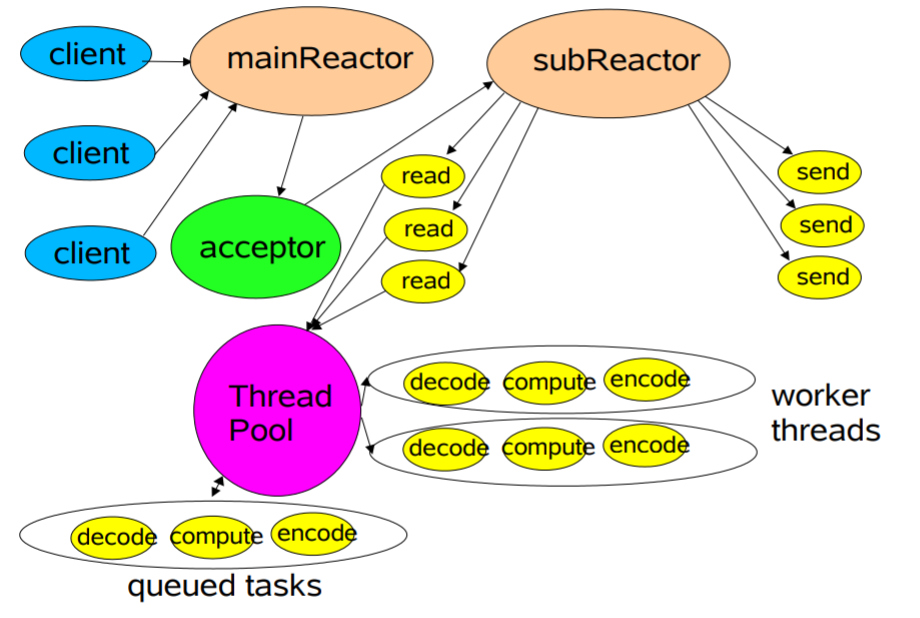

- `mainReactor`和`subReactor`就相当于`Reactor`模式中的`Initiation Dispatcher`，`mainReactor`用来接受连接，接收后通过`acceptor`将连接扔给`subReactor`。`bossGroup`相当于`mainReactor`，`workerGroup`相当于`subReactor`。

- 实现：

  - 在`ServerBootstrap`的`init(Channel channel)`方法中有如下实现：

    ```java
    @Override
    void init(Channel channel) throws Exception {
        // ...
        ChannelPipeline p = channel.pipeline();
        // ...
        p.addLast(new ChannelInitializer<Channel>() {
            @Override
            public void initChannel(final Channel ch) throws Exception {
            // ...
                ch.eventLoop().execute(new Runnable() {
                	@Override
                	public void run() {
                		// 往channel的pipeline中添加一个ServerBootstrapAcceptor
                    	pipeline.addLast(new ServerBootstrapAcceptor(
                                    ch, currentChildGroup, currentChildHandler, currentChildOptions, currentChildAttrs));
    				}
    			});
    		}
    	});
    }
    ```

  - 而`ServerBootstrapAcceptor`是`io.netty.bootstrap.ServerBootstrap`的一个静态私有内部类，它继承了`ChannelInboundHandlerAdapter`类，它实现的`channelRead()`方法中有如下代码：

    ```java
    // childGroup是一个EventLoopGroup对象，使用它注册Channel类型的child，
    childGroup.register(child).addListener(new ChannelFutureListener() {
    	@Override
    	public void operationComplete(ChannelFuture future) throws Exception {
    		if (!future.isSuccess()) {
    			forceClose(child, future.cause());
            }
    	}
    });
    ```

- 执行流程
  - 多个客户端向`BossGroup`发起连接请求，`BossGroup`基于`NIO`的选择器进行操作，里面会有一个`selector`，`selector`不断循环，检测客户端向其发起的连接。`BossGroup`监听`OP_ACCEPT`事件，一旦事件发生后，会接受这个连接。将`accept()`方法返回的结果传递给`WorkerGroup`。
  - `accept()`方法返回的结果是`SelectionKey`的集合，`SelectionKey`有个`channel()`方法，这个方法返回 `SelectableChannel` ，这个`SelectableChannel`就是`java.nio.channels.SocketChannel`，这个`SocketChannel`会被注册到`WorkerGroup`的`selector`上。
  - 将客户端的连接转交给`WorkerGroup`，`WorkerGroup`监听`OP_READ`事件，它的`selector`不断循环，等待事件的发生。事件到达时，直接和`WorkerGroup`进行数据传递。


