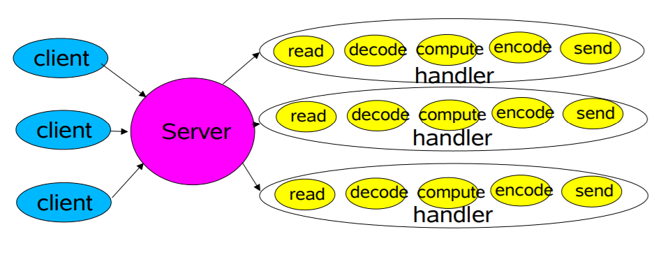
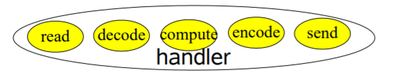
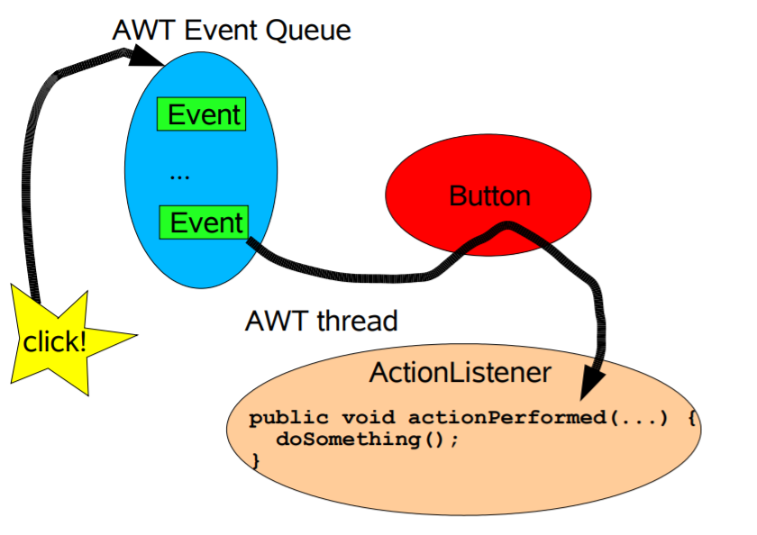
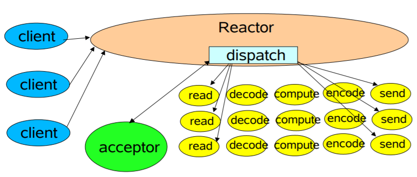
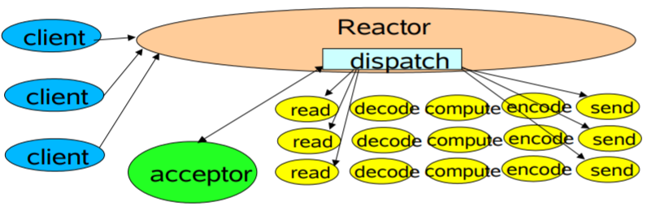
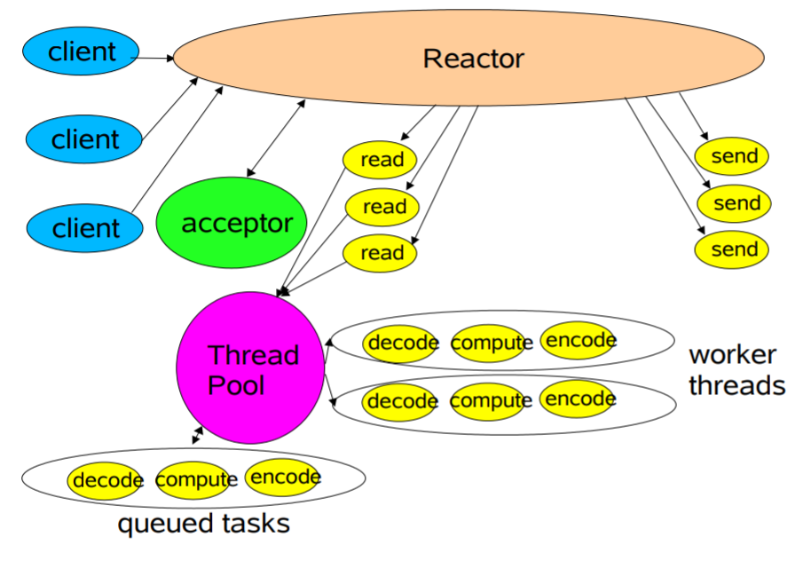

* [Java中可伸缩的IO](#java%E4%B8%AD%E5%8F%AF%E4%BC%B8%E7%BC%A9%E7%9A%84io)
  * [大纲](#%E5%A4%A7%E7%BA%B2)
  * [网络服务](#%E7%BD%91%E7%BB%9C%E6%9C%8D%E5%8A%A1)
  * [经典的服务设计](#%E7%BB%8F%E5%85%B8%E7%9A%84%E6%9C%8D%E5%8A%A1%E8%AE%BE%E8%AE%A1)
  * [经典的ServerSocket Loop](#%E7%BB%8F%E5%85%B8%E7%9A%84serversocket-loop)
  * [可伸缩性的目标](#%E5%8F%AF%E4%BC%B8%E7%BC%A9%E6%80%A7%E7%9A%84%E7%9B%AE%E6%A0%87)
  * [divide\-and\-conquer](#divide-and-conquer)
  * [事件驱动设计](#%E4%BA%8B%E4%BB%B6%E9%A9%B1%E5%8A%A8%E8%AE%BE%E8%AE%A1)
  * [背景：AWT中的事件](#%E8%83%8C%E6%99%AFawt%E4%B8%AD%E7%9A%84%E4%BA%8B%E4%BB%B6)
  * [Reactor 模式](#reactor-%E6%A8%A1%E5%BC%8F)
  * [基础版本的Reactor设计](#%E5%9F%BA%E7%A1%80%E7%89%88%E6%9C%AC%E7%9A%84reactor%E8%AE%BE%E8%AE%A1)
  * [java\.nio的支持](#javanio%E7%9A%84%E6%94%AF%E6%8C%81)
  * [Reactor 1: Setup](#reactor-1-setup)
  * [Reactor 2: Dispatch Loop](#reactor-2-dispatch-loop)
  * [Reactor 3:Acceptor](#reactor-3acceptor)
  * [Reactor 4:Handler setup](#reactor-4handler-setup)
  * [Reactor 5:Request handling](#reactor-5request-handling)
  * [Per\-State Handlers](#per-state-handlers)
  * [多线程的设计](#%E5%A4%9A%E7%BA%BF%E7%A8%8B%E7%9A%84%E8%AE%BE%E8%AE%A1)
  * [工作线程](#%E5%B7%A5%E4%BD%9C%E7%BA%BF%E7%A8%8B)
  * [handler with thread pool](#handler-with-thread-pool)
  * [任务协调](#%E4%BB%BB%E5%8A%A1%E5%8D%8F%E8%B0%83)
  * [使用PooledExecutor](#%E4%BD%BF%E7%94%A8pooledexecutor)
  * [多个Reactor线程](#%E5%A4%9A%E4%B8%AAreactor%E7%BA%BF%E7%A8%8B)
  * [使用多个Reactor](#%E4%BD%BF%E7%94%A8%E5%A4%9A%E4%B8%AAreactor)
  * [使用其他的java\.nio的特性](#%E4%BD%BF%E7%94%A8%E5%85%B6%E4%BB%96%E7%9A%84javanio%E7%9A%84%E7%89%B9%E6%80%A7)
  * [基于连接的扩展](#%E5%9F%BA%E4%BA%8E%E8%BF%9E%E6%8E%A5%E7%9A%84%E6%89%A9%E5%B1%95)
  * [API浏览](#api%E6%B5%8F%E8%A7%88)

# Java中可伸缩的`IO`

`Doug Lea`

## 大纲

- 可伸缩的网络服务

- 事件驱动的处理

- `Reactor`模式
  - 基础版本
  - 多线程版本
  - 其他的变种
- 漫读`java nio`的`API`

## 网络服务

- `Web Services`、`Distributed Objects`等等
- 大部分都有相同的基本结构
  - `Read request`
  - `Decode request`
  - `Process service`
  - `Encode reply`
  - `Send reply`
- 但每一步的花费及本质是不同的
  - `xml`解析，文件传输，`web`页面生成，计算服务

## 经典的服务设计



- 多个客户端向服务端发起连接，服务端用相应的处理器处理请求，每个处理器在自己的线程中启动
- 缺点：一个连接一个线程，如果连接数太大，

## 经典的`ServerSocket Loop`

```java
class Server implements Runnable {
    public void run() {
        try {
            ServerSocket ss = new ServerSocket(PORT);
 			while (!Thread.interrupted())
                // 生成新的线程，里面的handler处理客户端请求
 				new Thread(new Handler(ss.accept())).start();
		 } catch (IOException ex) { /* ... */ }
 	}
 	static class Handler implements Runnable {
		final Socket socket;
 		Handler(Socket s) { socket = s; }
 		public void run() {
            // IO操作
 			try {
 				byte[] input = new byte[MAX_INPUT];
                // 获取输入流，读数据
 				socket.getInputStream().read(input);
                // 获取输出流，写数据
 				byte[] output = process(input);
 				socket.getOutputStream().write(output);
 			} catch (IOException ex) { /* ... */ }
 		}
 		private byte[] process(byte[] cmd) { /* ... */ }
 	}
}
```

## 可伸缩性的目标

- 负载增加(客户端连接)时做到优雅降级
- 资源(`CPU、memory、disk、bandwidth`)增加时候做到持续的改进
- 可用性及性能目标
  - 更短的延迟
  - 高峰期需求
  - 对于服务质量可以进行调节
- `divide-and-conquer`通常是获取任何可伸缩性目标的最佳方式

## divide-and-conquer

- 将处理分解成小任务

  - 每个任务都在不阻塞的情况下执行一个动作

- 当可用的时候执行每个任务

  - `IO`事件通常作为触发器来实现

    

- `java.nio`中支持的基本的机制
  - 非阻塞的读和写
  - 分发与能感知到的`IO`事件相关的任务
- 很多的变种
  
  - 一系列事件驱动的设计

## 事件驱动设计

- 通常比其他方式效率更高

  - 占用更少的资源，并不需要每个客户端都产生一个线程
  - 成本更低，上下文切换少了，锁也更少了
  - 但分发变得更慢，手动的将动作绑定到事件上

- 通常编程更困难

  - 必须分解为简单的非阻塞的动作
    - 类似于`GUI`中的事件驱动动作
    - 不能消除所有的阻塞：比如`GC`，页面失败

  - 必须跟踪服务的逻辑状态(因为都是异步，要让前一个操作的结果让后一个操作能接收到)

## 背景：AWT中的事件

- 
  - 用户单击按钮，通过`ActionListener`，`actionPerformed()`方法会被执行
- 事件驱动`IO`用了类似的观点，但在设计上完全不同

## Reactor 模式

- `reactor`通过分发合适的处理器来响应`IO`事件
  - 类似于`AWT`的线程
- 处理器执行非阻塞的动作
  - 类似于`AWT`中的`actionListeners`
- 通过将处理器绑定到事件来进行管理
  - 类似于`AWT`中的`addActionListener`
- 参见`《Pattern-Oriented Software Architecture》`这本书

## 基础版本的`Reactor`设计

​	

- 单线程版本
- 会检测或监听客户端向服务器发起的连接，连接建立好后，`Reactor`会通过派发`(dispatch)`的方式将客户端发送的数据派发给特定的处理器，由处理器处理

## java.nio的支持

- `Channels`
  - 连接到文件、`socket`等等，支持非阻塞的读
- `Buffers`
  - 类似于数组的对象，可以被`Channel`直接的读或写
- `Selectors`
  - 告诉我们一组`Channel`中哪些有`IO`事件
- `SelectionKeys`
  - 维护`IO`事件的状态和绑定信息

## Reactor 1: Setup

```java
class Reactor implements Runnable {
    final Selector selector;
    final ServerSocketChannel serverSocket;
    
    Reactor(int port) throws IOException {
        // 创建Selector对象
        selector = Selector.open();
        // 创建ServerSocketChannel对象
        serverSocket = ServerSocketChannel.open();
        // 绑定到特定地址
        serverSocket.socket().bind(new InetSocketAddress(port));
        // 配置为非阻塞
        serverSocket.configureBlocking(false);
        // 注册，键为 SelectionKey.OP_ACCEPT
        SelectionKey sk = serverSocket.register(selector,SelectionKey.OP_ACCEPT);
        sk.attach(new Acceptor());
    }
    /** 
     * 也可以通过这种方式来创建Selector
     *
     * SelectorProvider p = SelectorProvider.provider();
     * selector = p.openSelector();
     * serverSocket = p.openServerSocketChannel(); 
     */
```

## Reactor 2: Dispatch Loop

```java
    // class Reactor continued
    public void run() { // normally in a new
        Thread
        try {
            while (!Thread.interrupted()) {
                selector.select();
                Set selected = selector.selectedKeys();
                Iterator it = selected.iterator();
                while (it.hasNext())
                    dispatch((SelectionKey)(it.next());
                selected.clear();
            }
        } catch (IOException ex) { /* ... */ }
    }
    void dispatch(SelectionKey k) {
        // 通过attachment方法获取之前attach的Acceptor对象
        Runnable r = (Runnable)(k.attachment());
        if (r != null)
            r.run();
    }
```

## Reactor 3:Acceptor

```java
    // class Reactor continued
    class Acceptor implements Runnable { // inner
        public void run() {
            try {
                SocketChannel c = serverSocket.accept();
                if (c != null)
                    new Handler(selector, c);
            }catch(IOException ex) { /* ... */ }
        }
    }
}
```



## Reactor 4:Handler setup

```java
final class Handler implements Runnable {
    final SocketChannel socket;
    final SelectionKey sk;
    ByteBuffer input = ByteBuffer.allocate(MAXIN);
    ByteBuffer output = ByteBuffer.allocate(MAXOUT);
    static final int READING = 0, SENDING = 1;
    int state = READING;
    Handler(Selector sel, SocketChannel c) throws IOException {
        socket = c; 
        c.configureBlocking(false);
        // Optionally try first read now
        sk = socket.register(sel, 0);
        sk.attach(this);
        // 对读感兴趣
        sk.interestOps(SelectionKey.OP_READ);
        sel.wakeup();
    }
    boolean inputIsComplete() { /* ... */ }
    boolean outputIsComplete() { /* ... */ }
    void process() { /* ... */ }
```

## Reactor 5:Request handling

```java
    // class Handler continued
    public void run() {
        try {
            if (state == READING) read();
            else if (state == SENDING) send();
        } catch (IOException ex) { /* ... */ }
    }
    void read() throws IOException {
        socket.read(input);
        if (inputIsComplete()) {
            process();
            state = SENDING;
            // Normally also do first write now
            sk.interestOps(SelectionKey.OP_WRITE);
        }
    }
    void send() throws IOException {
        socket.write(output);
        if (outputIsComplete()) 
            sk.cancel();
    }    
}
```

## Per-State Handlers

- 状态对象模式的简单使用

  ```java
  class Handler { // ...
      public void run() { // initial state is reader
          socket.read(input);
          if (inputIsComplete()) {
              process();
              sk.attach(new Sender());
              sk.interest(SelectionKey.OP_WRITE);
              sk.selector().wakeup();
          }
      }
      class Sender implements Runnable {
          public void run(){ // ...
              socket.write(output);
              if (outputIsComplete()) 
                  sk.cancel();
          }
      }
  }
  ```

## 多线程的设计

- 策略性的增加了一些线程来实现可伸缩性
  - 主要应用在多核处理器中
- 工作线程
  - `Reactors`应该快速触发处理器
    - 处理器的处理会减慢`reactor`
  - 建议将非`IO`的处理转移给其他线程来完成
- 多`Reactor`线程
  - `Reactor`线程能进行`IO`处理
  - 将负载转移给其他的`reactor`
    - 负载均衡来匹配`CPU`和`IO`的速率

## 工作线程

- 将非`IO`处理移交出去以加快`Reactor`线程

  - 类似于`POSA2 Proactor`设计

- 比将计算绑定处理重写为事件驱动形式更简单

  - 依然应该是纯粹的非阻塞的计算
    - 足以超过负载的处理

- 但很难与`IO`重叠处理

  - 最好第一次就把所有输入读入到`buffer`中

- 使用线程池可以进行调节和控制

  - 通常需要的线程数量比客户端更少

  

## handler with thread pool

```java
class Handler implements Runnable {
    // uses util.concurrent thread pool
    static PooledExecutor pool = new PooledExecutor(...);
    static final int PROCESSING = 3;
    // ...
    synchronized void read() { // ...
        socket.read(input);
        if (inputIsComplete()) {
            state = PROCESSING;
            // 使用线程池处理任务
            pool.execute(new Processer());
        }
    }
    synchronized void processAndHandOff() {
        process();
        state = SENDING; // or rebind attachment
        // 改变兴趣集为OP_WRITE
        sk.interest(SelectionKey.OP_WRITE);
    }
    class Processer implements Runnable {
        public void run() { 
            processAndHandOff(); 
        }
    }
}
```

## 任务协调

- `handoffs`
  - 每一个任务都可以触发或者调用下一个，通常这是最快的，但这么做可能会很脆弱
- `callbacks`
  - 针对于每个处理器分发器
  - 设置状态
  - 是中介模式的一个变种
- `queues`
  - 比如在每个阶段传递`buffer`

- `futures`
  - 当每个任务生成一个结果
  - 可通过`join`或者`wait/notify`等方式协调

## 使用PooledExecutor

- 一个可以调节的工作线程池
- 主要的方法是`execute(Runnable r)`
- 可以控制
  - 任务队列的种类
  - 最大线程数
  - 最小线程数
  - 按需线程
  - 保持活动间隔直到空闲线程死亡
    - 如果有必要后续可以被新线程替换
  - 饱和策略
    - 阻塞、丢弃等

## 多个Reactor线程

- 使用`Reactor`池

  - 用于匹配`CPU`和`IO`执行速率

  - 静态或者动态构建

    - 每一个里面都有自己的`Selector`，线程，分发循环

  - 主要的接收器会给`Reactor`分发

    ```java
        Selector[] selectors; // also create threads
        int next = 0;
        class Acceptor { // ...
            public synchronized void run() { ...
                Socket connection = serverSocket.accept();
                if (connection != null)
                    new Handler(selectors[next], connection);
                if (++next == selectors.length) next = 0;
            }
        }
    ```

## 使用多个Reactor


## 使用其他的java.nio的特性

- 每个`Reactor`有多个`Selector`
  - 将不同的处理器绑定到不同的`IO`事件上
  - 需要仔细考虑同步来进行协调
- 文件传输
  - 自动化的文件到网络或者网络到文件的拷贝
- 内存映射文件
  - 通过`buffer`访问文件
- 直接缓冲区
  - 有时可以实现零拷贝传输
  - 有创建或者销毁的负担
  - 对长时间存活的应用最有效

## 基于连接的扩展

- 相对于单个服务的请求
  - 客户端连接
  - 客户端发送一系列请求/消息
  - 客户端断开连接
- 例子
  - 数据库和事务监控
  - 多人游戏、聊天等等
- 可扩展基本的网络服务模式
  - 处理许多相对存活较长时间的客户端
  - 跟踪客户端和会话状态
  - 跨多个主机分发服务

## API浏览

- `Buffer`
  - `ByteBuffer`
- `Channel`
  - `SelectableChannel`
  - `SocketChannel`
  - `ServerSocketChannel`
  - `FileCHannel`
- `Selector`
- `SelectionKey`