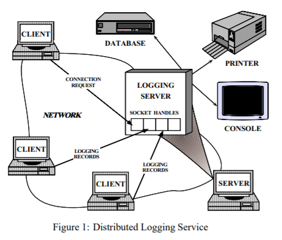
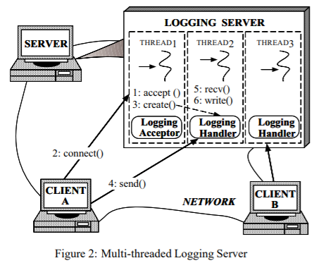

[toc]

# Reactor

用于同步事件的多路分解和分发处理的对象行为模式

## 意图

- `Reactor`设计模式是指处理由一个或多个客户端并发的向一个应用发送服务请求。应用中的每个服务可能由几个方法组成，并且由一个单独的事件处理器表示，事件处理器用于将特定于服务的请求进行分发。事件处理器的分发有一个`initiation dispatcher`来完成，它会管理注册的事件处理器。服务请求的分离是由一个同步的事件分离器来执行的。

##别称

- 分发器、通知器

## 实例

- 为了说明`Reactor`模式，设计了图1中展示的基于事件驱动的分布式日志服务。客户端应用在一个分布式环境中使用日志服务记录它们的状态信息。这些状态信息通常包括错误通知、调试追踪信息、性能报告等。日志记录被发送到一个中央日志服务器中，这个中央日志服务器可以将记录写到多个输出设备中，比如控制台，打印机，文件或者网络管理数据库。
- 图1中展示的日志服务器处理日志记录和客户端发色的连接请求。日志记录和连接请求可能在多个处理器中同时到达。处理器标识操作系统管理的网络通信资源。
- 
- 日志服务器和客户端通过使用一个面向连接的协议进行通信，比如`TCP`。要记录数据的客户端必须先向服务器发送一个连接请求。服务器使用一个`handler factory`来等待这些连接请求，`handler factory`监听客户端已知的地址。当一个连接请求到达时，`handler factory`在客户端和服务器之间通过创建一个新的处理器建立一个连接，这个处理器代表连接的终结点。这个处理器返回到服务器，然后服务器等待客户端服务请求到达处理器。一旦客户端连接，它们可以并发的向服务器发送日志记录，服务器通过连接的`socket `句柄接收这些记录。
- 或许开发一个并发的日志服务器最直观的方法是使用多线程，因为它可以处理多个客户端并发，比如图2中展示的。这种方法同步的接收网络连接，并且生成一个“每个连接一个线程”来处理客户端的日志记录
- 
- 然而，在服务器中使用多线程来实现日志记录的处理无法解决如下问题。
  - **`Efficiency`**：由于上下文切换、同步、数据移动可能会导致性能下降
  - **`Programming simplicity`**：线程可能需要复杂的并发控制方案
  - **`Portability(可移植性)`**：线程不是在所有操作系统平台上都可用

- 由于这些缺点，多线程通常不是开发日志服务器最有效的或者最简单的解决方案

## 上下文

- 在一个分布式系统中一个服务器应用并发的从一个或多个客户端中接收事件